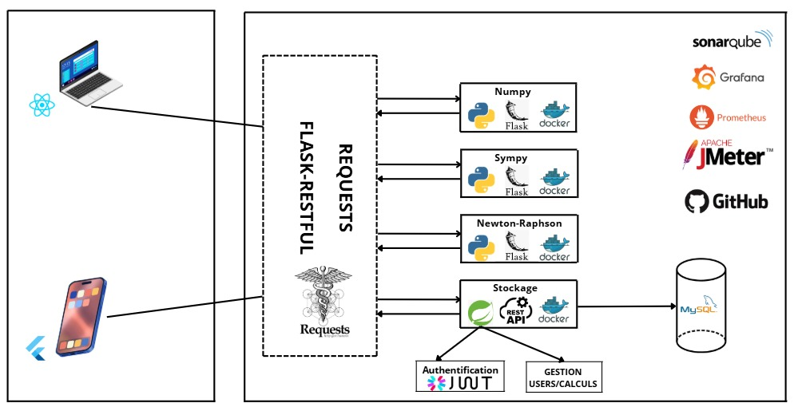

# Calcul des Racines de Polynômes et Factorisation Symbolique  

## Auteurs  
BENZALA, BOURHAZI, AIT IHSSAN, IBOURKI, BELAHRECH  

## Description  
Ce projet est une solution logicielle modulaire et automatisée pour le calcul des racines de polynômes. Il exploite des microservices pour effectuer des calculs numériques et symboliques à l'aide de bibliothèques comme **Numpy**, **Sympy**, **Newton-Raphson** , et l' **algorithme de Matplotlib** pour visualiser le graphe de solutions .  

L'application est accessible via des interfaces web et mobiles, permettant aux utilisateurs de soumettre des polynômes, de choisir un algorithme de calcul et de consulter l'historique des résultats en plus d'une visualisation graphique de polynome.  

## Fonctionnalités principales  
- **Calcul automatique des racines de polynômes** (Numpy, Sympy, Newton-Raphson)  
- **Gestion des utilisateurs** (inscription, connexion, récupération de mot de passe) incluant JWT
- **Historique des calculs**  
- **Notification par email**  
- **Interfaces Web et Mobile** (ReactJS et Flutter)  
- **Portabilité et Scalabilité** grâce à Docker  

---

## Architecture du logiciel  
L'application est construite autour de quatre microservices principaux :  
- **Microservice de Stockage (Spring Boot)** : Gestion des utilisateurs avec JWT et stockage de polynomes en base de données MySQL
- **Microservice Numpy (Flask/Python)** : Calcul numérique des racines  
- **Microservice Sympy (Flask/Python)** : Factorisation symbolique et calcul algébrique  
- **Microservice Newton-Raphson (Flask/Python)** : Approximations itératives des racines  
  
---

## Flux de calcul de racines polynomiales  
Ce diagramme illustre le flux de calcul des racines polynomiales :  

  

---

## Monitoring avec Grafana  
Des tableaux de bord Grafana permettent de surveiller les performances des microservices et d’analyser les indicateurs clés.  

### Taux de succès total  
  

### Ratio de création  
  

### Temps de réponse (Total)  
  

### Temps de réponse (Nombre de requêtes)  
  

### Temps de réponse (Global)  
  

---

## Analyse SonarQube  
L'analyse SonarQube garantit la qualité et la sécurité du code source pour chaque microservice.  

### Microservice Newton-Raphson  
  

### Microservice Numpy  
  
  ### Microservice Sympy  
 
### Microservice Matplotlib
 

### Microservice SPRING BOOT  
  

---
### Vidéo démonstration
[Vidéo démonstration](https://streamable.com/1dn6t5)

---
## Images dans Docker
 

----
## Docker Compose
```bash
version: '3.8'

networks:
  app-network:
    driver: bridge

services:
  mysql:
    image: mysql:8.0
    container_name: mysqldb
    environment:
      MYSQL_ROOT_PASSWORD: root
      MYSQL_DATABASE: polynome
    ports:
      - "3307:3306"
    networks:
      - app-network
    healthcheck:
      test: [ "CMD-SHELL", "mysqladmin ping -h localhost -uroot -proot || exit 1" ]
      interval: 10s
      retries: 10
      start_period: 30s
      timeout: 5s

  spring-app:
    image: polynomespring-app
    container_name: spring-app
    build:
      context: ./MicroServiceStockage_CalculAutomatiseRacinePolynome
      dockerfile: Dockerfile
    ports:
      - "8082:8082"
    networks:
      - app-network
    environment:
      MYSQL_HOST: mysqldb
      MYSQL_USER: root
      MYSQL_PASSWORD: root
      MYSQL_PORT: 3306
    depends_on:
      mysql:
        condition: service_healthy

  python1:
    image: microservicepython1-traitement
    container_name: python1
    build:
      context: ./MicroServiceTraitement-Calcul-Automatis-Racine-Poylynomes
      dockerfile: Dockerfile
    ports:
      - "5110:5110"
    networks:
      - app-network
    environment:
      FLASK_ENV: production

  python2:
    image: microservicepython2-traitement
    container_name: python2
    build:
      context: ./MicroServiceTraitement2-Calcul-Automatis-Racine-Poylynomes
      dockerfile: Dockerfile
    ports:
      - "5001:5001"
    networks:
      - app-network
    environment:
      FLASK_ENV: production

  python3:
    image: microservicepython3-traitement
    container_name: python3
    build:
      context: ./MicroServiceTraitement3-Calcul-Automatis-Racine-Poylynomes
      dockerfile: Dockerfile
    ports:
      - "5004:5004"
    networks:
      - app-network
    environment:
      FLASK_ENV: production

  react-frontend:
    image: polynomial-react-frontend
    container_name: react-frontend
    build:
      context: ./CalculPolynomial_Front_Web
      dockerfile: Dockerfile
    ports:
      - "3000:80"
    networks:
      - app-network
    depends_on:
      - spring-app
```

---
### Pipeline 
---
```bash
pipeline {
    agent any

    environment {
        // Définition des images Docker pour chaque service
        DOCKER_IMAGE_SPRING = 'polynomespring-app:latest'
        DOCKER_IMAGE_PYTHON1 = 'microservicepyth    on1-traitement:latest'
        DOCKER_IMAGE_PYTHON2 = 'microservicepython2-traitement:latest'
        DOCKER_IMAGE_PYTHON3 = 'microservicepython3-traitement:latest'
        DOCKER_IMAGE_REACT = 'polynomial-react-frontend:latest'
    }

    stages {
        stage('Configurer les permissions pour Jenkins') {
            steps {
                script {
                    sh '''
                    echo "Vérification des permissions pour l'utilisateur Jenkins..."
                    
                    # Vérifiez si Jenkins appartient au groupe Docker
                    if ! groups jenkins | grep -q docker; then
                        echo "Ajout de l'utilisateur Jenkins au groupe Docker..."
                        usermod -aG docker jenkins
                        chown root:docker /var/run/docker.sock
                        echo "Permissions mises à jour pour Jenkins."
        
                        # Redémarrez automatiquement le conteneur Jenkins
                        CONTAINER_ID=$(hostname)
                        echo "Redémarrage du conteneur Jenkins ($CONTAINER_ID)..."
                        docker restart $CONTAINER_ID || { echo "Échec du redémarrage automatique. Veuillez redémarrer manuellement le conteneur."; exit 1; }
                        exit 1 # Arrêter le pipeline pour permettre au conteneur redémarré de prendre en compte les changements
                    fi
        
                    # Vérifiez si Jenkins peut accéder à Docker
                    echo "Vérification de l'accès Docker pour Jenkins..."
                    if ! docker ps >/dev/null 2>&1; then
                        echo "Échec de l'accès Docker pour Jenkins."
                        echo "Veuillez redémarrer manuellement le conteneur Jenkins pour appliquer les permissions."
                        exit 1
                    fi
        
                    echo "L'utilisateur Jenkins a correctement accès à Docker."
                    '''
                }
            }
        }


        stage('Installer les dépendances système') {
            steps {
                script {
                    sh '''
                    echo "Mise à jour des paquets système"
                    if [ "$(id -u)" -eq 0 ]; then
                        apt-get update
                        apt-get install -y python3.11-venv nodejs npm
                    else
                        echo "L'utilisateur actuel n'est pas root. Exécution avec Docker."
                        docker exec -u root jenkins_new bash -c "apt-get update && apt-get install -y python3.11-venv nodejs npm"
                    fi
                    '''
                }
            }
        }

        stage('Cloner le dépôt et les sous-modules') {
            steps {
                script {
                    echo "Clonage du dépôt et des sous-modules"
                    git url: 'https://github.com/Bourhazi/ACE_Project.git', branch: 'main'
                    sh 'git submodule update --init --recursive || git submodule update --force --recursive'
                }
            }
        }

        stage('Vérification et Checkout des branches') {
            steps {
                script {
                    echo "Mise à jour des sous-modules et sélection des branches correctes"
                    dir('MicroServiceStockage_CalculAutomatiseRacinePolynome') {
                        sh 'git fetch --all'
                        sh 'git checkout main_test'
                    }
                    dir('MicroServiceTraitement-Calcul-Automatis-Racine-Poylynomes') {
                        sh 'git fetch --all'
                        sh 'git checkout main_test'
                    }
                    dir('MicroServiceTraitement2-Calcul-Automatis-Racine-Poylynomes') {
                        sh 'git fetch --all'
                        sh 'git checkout main_test'
                    }
                    dir('MicroServiceTraitement3-Calcul-Automatis-Racine-Poylynomes') {
                        sh 'git fetch --all'
                        sh 'git checkout main_test'
                    }
                    dir('CalculPolynomial_Front_Web') {
                        script {
                            sh '''
                            git fetch --all
                            git checkout versionfinale
                            git pull origin versionfinale
                            if [ ! -f Dockerfile ]; then
                                echo "Erreur : Dockerfile manquant dans la branche versionfinale."
                                exit 1
                            fi
                            '''
                            sh 'docker build -t $DOCKER_IMAGE_REACT .'
                        }
                    }
                }
            }
        }

        stage('Installer les dépendances React') {
            steps {
                dir('CalculPolynomial_Front_Web') {
                    sh '''
                    npm install
                    '''
                }
            }
        }

        stage('Lancer React') {
            steps {
                dir('CalculPolynomial_Front_Web') {
                    sh '''
                    npm start &
                    '''
                }
            }
        }

        stage('Démarrer MySQL avec Docker Compose') {
            steps {
                script {
                    sh '''
                    # Vérifier si un conteneur "mysqldb" existe et le supprimer s'il est en conflit
                    if docker ps -a --format '{{.Names}}' | grep -q '^mysqldb$'; then
                        echo "Un conteneur existant nommé 'mysqldb' a été trouvé. Suppression..."
                        docker rm -f mysqldb
                    fi
        
                    # Lancer MySQL avec Docker Compose
                    docker-compose up -d mysql
                    '''
                }
            }
        }


        stage('Attendre que MySQL soit prêt') {
            steps {
                script {
                    def mysqlReady = false
                    for (int i = 0; i < 30; i++) {
                        sleep(10)
                        def result = sh(script: "docker exec mysqldb mysqladmin ping -h localhost -uroot -proot", returnStatus: true)
                        if (result == 0) {
                            mysqlReady = true
                            break
                        }
                    }
                    if (!mysqlReady) {
                        error "MySQL n'a pas démarré dans le délai imparti"
                    }
                }
            }
        }

        stage('Lancer le service Spring Boot') {
            steps {
                dir('MicroServiceStockage_CalculAutomatiseRacinePolynome') {
                    sh '''
                    git fetch --all
                    git checkout main_test
                    git pull origin main_test
                    if [ ! -f Dockerfile ]; then
                        echo "Erreur : Dockerfile manquant pour le service Spring Boot."
                        exit 1
                    fi
                    docker build -t $DOCKER_IMAGE_SPRING .
                    '''
                }
            }
        }

        stage('Lancer Python Microservices') {
            parallel {
                stage('Python 1') {
                    steps {
                        dir('MicroServiceTraitement-Calcul-Automatis-Racine-Poylynomes') {
                            sh '''
                            python3 -m venv venv
                            venv/bin/pip install -r requirements.txt
                            nohup venv/bin/python app.py &
                            '''
                        }
                    }
                }
                stage('Python 2') {
                    steps {
                        dir('MicroServiceTraitement2-Calcul-Automatis-Racine-Poylynomes') {
                            sh '''
                            python3 -m venv venv
                            venv/bin/pip install -r requirements.txt
                            nohup venv/bin/python app2.py &
                            '''
                        }
                    }
                }
                stage('Python 3') {
                    steps {
                        dir('MicroServiceTraitement3-Calcul-Automatis-Racine-Poylynomes') {
                            sh '''
                            python3 -m venv venv
                            venv/bin/pip install -r requirements.txt
                            nohup venv/bin/python app5.py &
                            '''
                        }
                    }
                }
            }
        }

        stage('Démarrer les services avec Docker Compose') {
            steps {
                script {
                    sh '''
                    # Vérifier et supprimer les conteneurs existants
                    for container in mysqldb python1 python2 python3 spring-app; do
                        if docker ps -a --format '{{.Names}}' | grep -q "^$container$"; then
                            echo "Suppression du conteneur existant : $container"
                            docker rm -f $container
                        fi
                    done
        
                    # Lancer les services avec docker-compose
                    docker-compose up -d
                    '''
                }
            }
        }


        stage('Arrêter les conteneurs') {
            steps {
                dir('ACE_Project-') {
                    sh 'docker-compose down'
                }
            }
        }
    }
}

```
----

## Intégration des pipelines

Nous avons intégré un pipeline CI/CD avec Jenkins pour automatiser le processus de développement, de test et de déploiement de l'application. Ce pipeline gère plusieurs étapes essentielles, notamment la gestion des permissions, l'installation des dépendances, le clonage des dépôts, la construction des images Docker pour les différents microservices et le déploiement via Docker Compose. Cette approche garantit un flux de travail efficace, réduit les erreurs manuelles et facilite la mise à jour continue de l'application.

 
---
## Impact  
Notre projet présente plusieurs impacts significatifs :  
- **Calculs rapides et automatisés** – Réduction du temps de traitement (minutes au lieu d'heures)  
- **Accessibilité** – Application web et mobile accessible en tout lieu  
- **Automatisation** – Moins de tâches répétitives pour les chercheurs et ingénieurs  

---

## Technologies Utilisées  
- **Backend :** Spring Boot, Python
- **Frontend :** ReactJS, Flutter  
- **Containerisation :** Docker  
- **Monitoring :** Grafana, Prometheus  
- **Tests de charge :** Apache JMeter  
- **Analyse de code :** SonarQube  

---


## Installation et Exécution  
### Prérequis :  
- Docker et Docker Compose  
- Node.js et npm (pour React)  
- Flutter SDK  

### Cloner le projet :  
```bash
git clone --recurse-submodules https://github.com/Bourhazi/ACE_Project.git
cd ACE_Project
```
---

#### Lancer les Services avec Docker
```bash
docker-compose build
docker-compose up
```
---
### Accéder à l'application :
Frontend Web : http://localhost:3000


API Backend : http://localhost:8082

---
## Utilisation 
### Pour se connecter en tant que calculateur :
email:notaila7@gmail.com
password : password123

----

### Pour se connecter en tant qu'admin :
email:root@gmail.com
password : root

---
### Pour arreter et supprimer  tous les conteneurs en cours d'execution :
docker-compose down

---


