# Calcul des Racines de Polynômes et Factorisation Symbolique  

## Auteurs  
BENZALA, BOURHAZI, AIT IHSSAN, IBOURKI, BELAHRECH  

## Description  
Ce projet est une solution logicielle modulaire et automatisée pour le calcul des racines de polynômes. Il exploite des microservices pour effectuer des calculs numériques et symboliques à l'aide de bibliothèques comme **Numpy**, **Sympy**, et l'**algorithme de Newton-Raphson**.  

L'application est accessible via des interfaces web et mobiles, permettant aux utilisateurs de soumettre des polynômes, de choisir un algorithme de calcul et de consulter l'historique des résultats.  

## Fonctionnalités principales  
- **Calcul automatique des racines de polynômes** (Numpy, Sympy, Newton-Raphson)  
- **Gestion des utilisateurs** (inscription, connexion, récupération de mot de passe)  
- **Historique des calculs**  
- **Notification par email**  
- **Interfaces Web et Mobile** (ReactJS et Flutter)  
- **Portabilité et Scalabilité** grâce à Docker  

---

## Architecture du logiciel  
L'application est construite autour de quatre microservices principaux :  
- **Microservice de Stockage (Spring Boot)** : Gestion des requêtes utilisateur et stockage  
- **Microservice Numpy (Flask/Python)** : Calcul numérique des racines  
- **Microservice Sympy (Flask/Python)** : Factorisation symbolique et calcul algébrique  
- **Microservice Newton-Raphson (Flask/Python)** : Approximations itératives des racines  

---

## Diagramme BPMN  
Ce diagramme illustre le flux de calcul des racines polynomiales :  

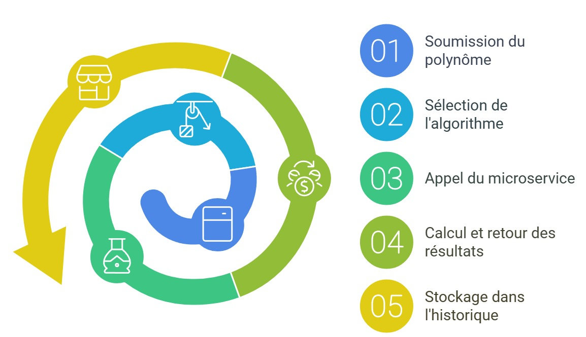  

---

## Monitoring avec Grafana  
Des tableaux de bord Grafana permettent de surveiller les performances des microservices et d’analyser les indicateurs clés.  

### Taux de succès total  
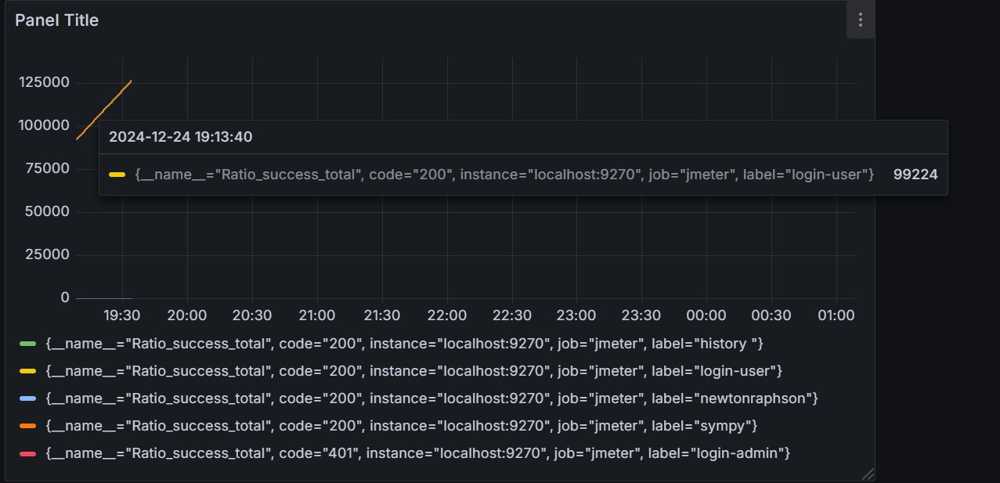  

### Ratio de création  
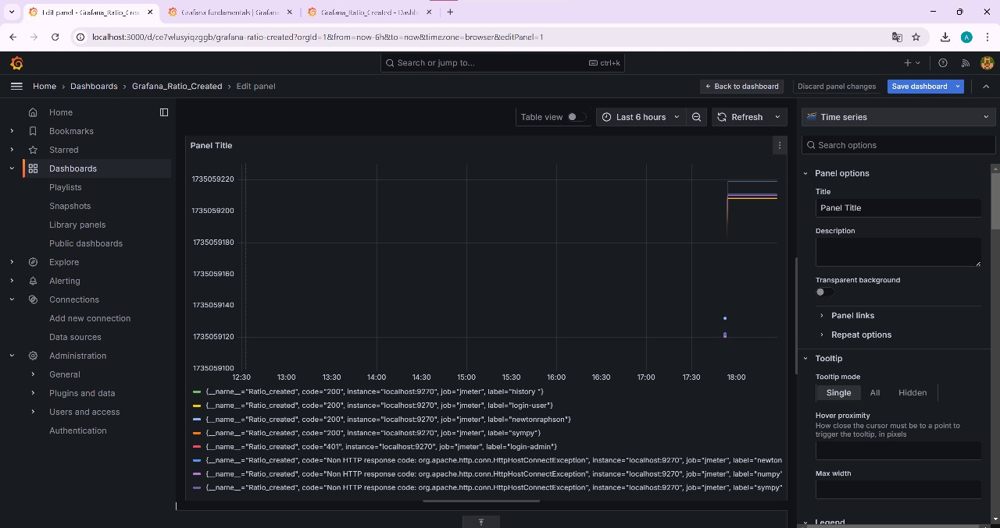  

### Temps de réponse (Total)  
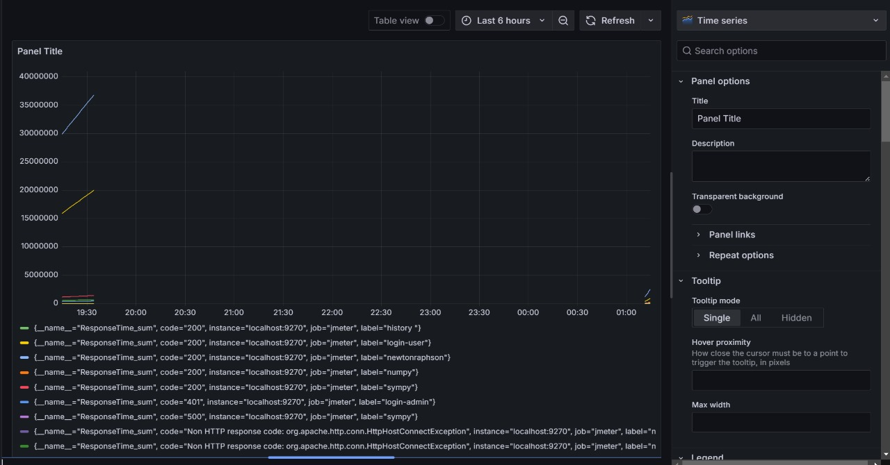  

### Temps de réponse (Nombre de requêtes)  
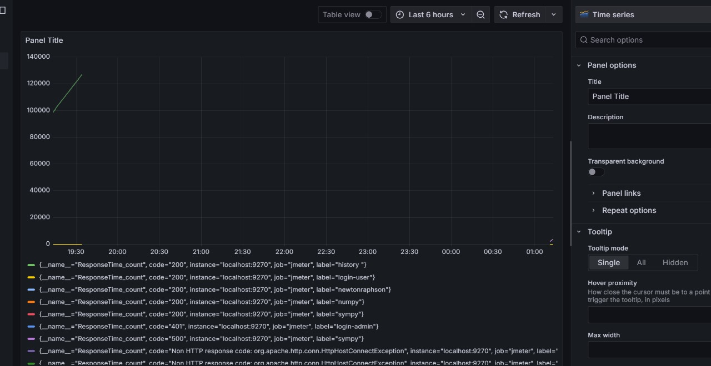  

### Temps de réponse (Global)  
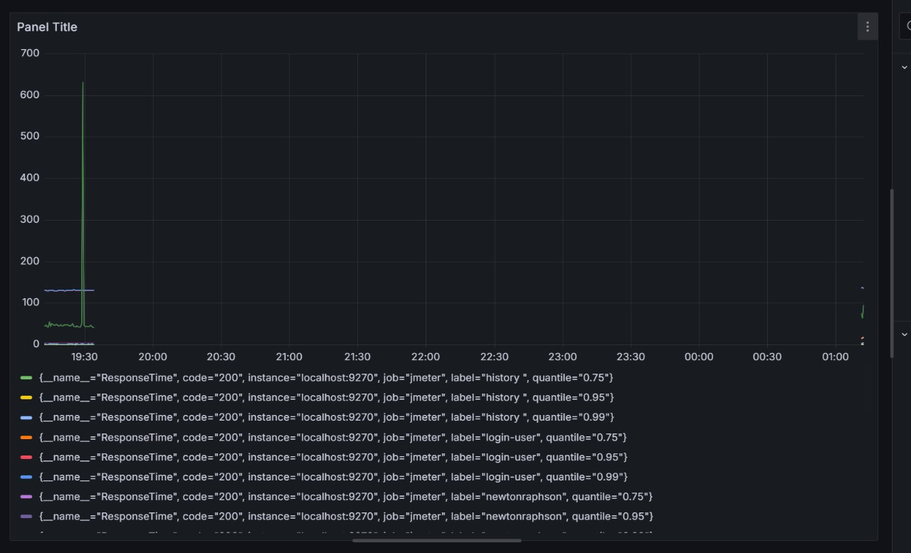  

---

## Analyse SonarQube  
L'analyse SonarQube garantit la qualité et la sécurité du code source pour chaque microservice.  

### Microservice Newton-Raphson  
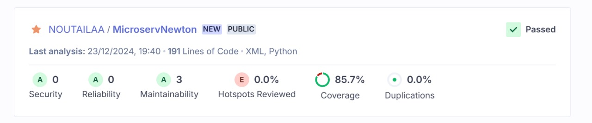  

### Microservice Numpy  
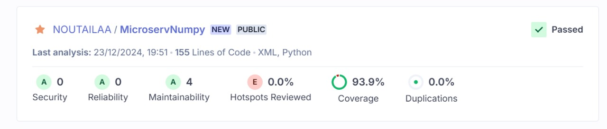  

### Microservice Sympy  
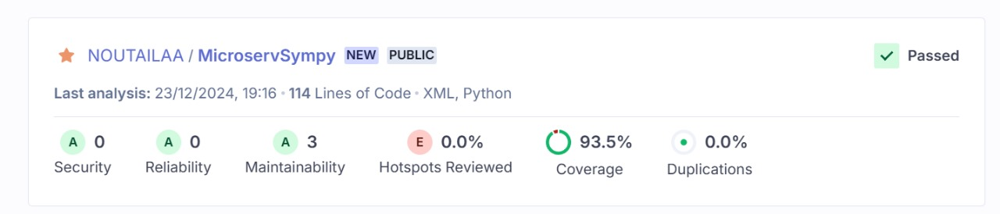  

### Microservice SPRING BOOT  
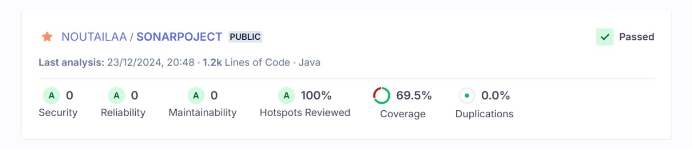  
---
## Images dans Docker
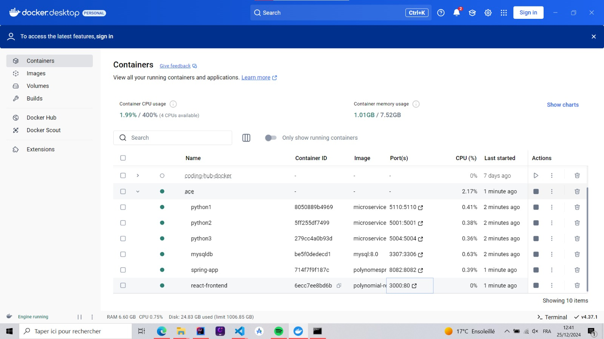 

---
## Intégration des pipelines

Nous avons intégré un pipeline CI/CD avec Jenkins pour automatiser le processus de développement, de test et de déploiement de l'application. Ce pipeline gère plusieurs étapes essentielles, notamment la gestion des permissions, l'installation des dépendances, le clonage des dépôts, la construction des images Docker pour les différents microservices et le déploiement via Docker Compose. Cette approche garantit un flux de travail efficace, réduit les erreurs manuelles et facilite la mise à jour continue de l'application.

---
## Impact  
Notre projet présente plusieurs impacts significatifs :  
- **Calculs rapides et automatisés** – Réduction du temps de traitement (minutes au lieu d'heures)  
- **Accessibilité** – Application web et mobile accessible en tout lieu  
- **Automatisation** – Moins de tâches répétitives pour les chercheurs et ingénieurs  

---

## Technologies Utilisées  
- **Backend :** Spring Boot, Python
- **Frontend :** ReactJS, Flutter  
- **Containerisation :** Docker  
- **Monitoring :** Grafana, Prometheus  
- **Tests de charge :** Apache JMeter  
- **Analyse de code :** SonarQube  

---


## Installation et Exécution  
### Prérequis :  
- Docker et Docker Compose  
- Node.js et npm (pour React)  
- Flutter SDK  

### Cloner le projet :  
```bash
git clone https://github.com/Bourhazi/ACE_Project
cd ACE_Project
```
---

#### Lancer les Services avec Docker
docker-compose up
---
### Accéder à l'application :
Frontend Web : http://localhost:3000
API Backend : http://localhost:8082
---
### Pour arreter et supprimer  tous les conteneurs en cours d'execution :
docker-compose down

---
